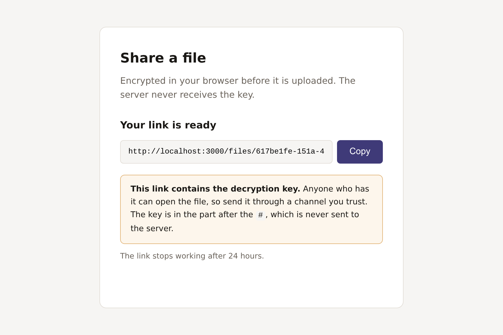
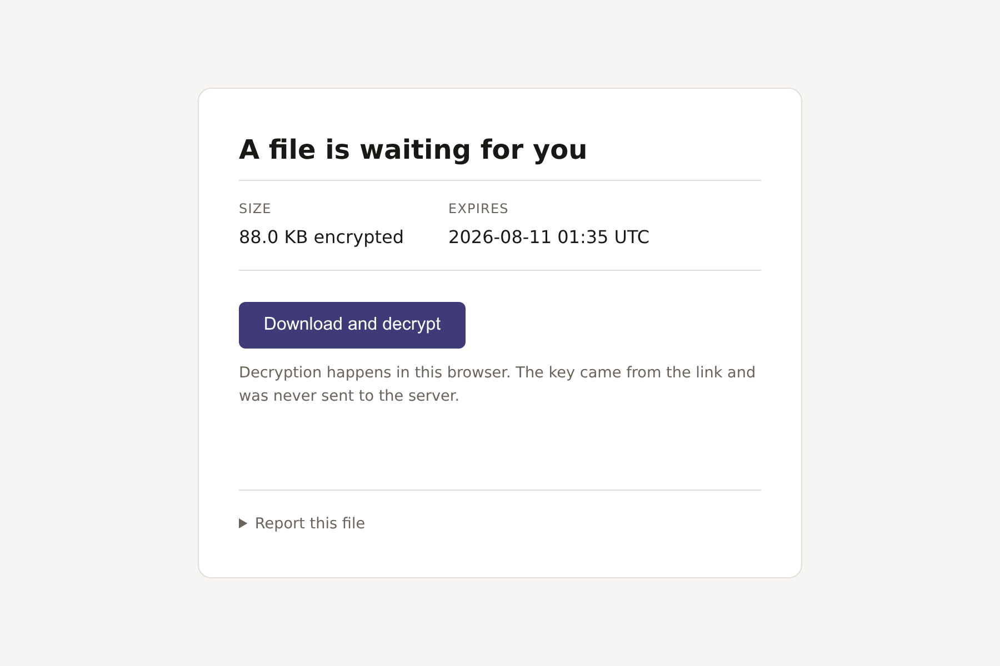

# QuickShare

Ephemeral file sharing where the server cannot read the files it stores.
Live at **[quickshare-har5.onrender.com](https://quickshare-har5.onrender.com)**.

Files are encrypted in the sender's browser before upload. The key goes in the URL fragment, the part after
`#`, which browsers do not send in a request and strip from `Referer`. The server only ever receives
ciphertext and a byte count.

This covers file **content**, not everything. The service still knows a file exists, how large it is, when
it arrived, and which addresses uploaded and downloaded it. Note also that this is not related to
zero-knowledge *proofs*, which is a different topic with a similar name.

| | |
|---|---|
|  |  |

## Threat model

The key never reaches the server, so stored files cannot be decrypted there.

The limit is that the server also serves the JavaScript that handles the key. A modified page could read
the fragment and send it elsewhere, so the trust assumption is about the code being served rather than the
files being stored. Page tampering is at least detectable: it is visible in the source and is served to
every visitor.

This applies to any browser-based end-to-end encryption. It is also why no page loads a third-party script
and why there is no client framework — anything running on the download page can read `location.hash`.

## How it works

1. The browser asks the server to reserve a uuid. This has to happen first, because the uuid is bound
   into the ciphertext.
2. The browser generates a 256-bit AES-GCM key, builds a small header holding the original filename and
   MIME type, and encrypts header and file together. The uuid is passed as additional authenticated data,
   so a blob served under a different uuid fails its tag check instead of decrypting into something
   unexpected.
3. The ciphertext is uploaded. The share link is assembled **in the browser** — the server never sees it,
   because it contains the key.
4. The recipient's browser reads the key from the fragment, clears it from the address bar, fetches the
   ciphertext, and decrypts. The original filename is recovered from inside the envelope, which is why no
   `Content-Disposition` header is ever sent.

Stored bytes are `IV ‖ ciphertext ‖ tag`. Links expire after 24 hours, enforced as a predicate on every
lookup rather than by a cleanup job — so a link is dead the moment it expires, whether or not anything
has run.

## Running it

Requires Node 20+ and PostgreSQL 13+ (`gen_random_uuid()` sets that floor). There is no build step.

```sh
npm ci
cp .env.example .env      # then fill in DATABASE_URL
npm run serve
```

The schema is applied automatically at boot and is idempotent, so there is no migration step. The default
storage driver writes blobs to `uploads/` on local disk, which is fine for development.

Two operator commands, neither of which decrypts anything:

```sh
npm run reports              # abuse reports, most-reported first
npm run takedown -- <uuid>   # remove a file and its metadata
```

## Architecture

Server-rendered Express with no client framework, four runtime dependencies (`express`, `ejs`, `dotenv`,
`pg`), and no bundler — the JavaScript served is the JavaScript in this repository.

```
routes/         HTTP only, no business logic
services/       what the application does
repositories/   port + Postgres adapter        metadata
storage/        port + disk and S3 adapters    blobs
rateLimit/      port + in-memory adapter
container.js    the only file that names concrete adapters
```

Services depend on interfaces, never on `pg` or `fs`, so swapping either store means one new adapter class
and one line in the composition root. Moving blobs from local disk to S3-compatible object storage for
deployment did not touch a service, route, or view.

The `files` table has no column for a filename, MIME type, or key, so there is nowhere to put them even by
accident. The public `uuid` and the internal `storage_key` are separate values, which keeps the object
store from being able to match a blob to a share link.

## Configuration

Every setting is an environment variable, documented in `.env.example`. `DATABASE_URL` is the only one
without a usable default.

Two worth knowing before deploying behind a proxy or load balancer:

- **`TRUST_PROXY`** decides whether `req.ip` is the client or the balancer, which every rate limit keys
  on. Unset behind a proxy, every visitor shares one bucket. Set too broadly, clients forge
  `X-Forwarded-For` and bypass limits. Set it to the number of proxies actually in front.
- **`STORAGE_DRIVER`** must be `s3` on any host with an ephemeral filesystem. On local disk, blobs vanish
  on restart while their metadata survives, so links resolve to nothing.

## Limitations

- **No malware scanning, and none is possible.** The server holds ciphertext and no key, so it cannot
  inspect what it stores. Abuse reporting and takedown are the only moderation available, and endpoint
  antivirus still applies because files are decrypted on the recipient's machine.
- **Metadata leaks.** Ciphertext length approximates plaintext length. Upload and download addresses and
  timings can link a sender to a recipient.
- **No owner tokens.** A sender cannot revoke a link before it expires; only the operator can.
